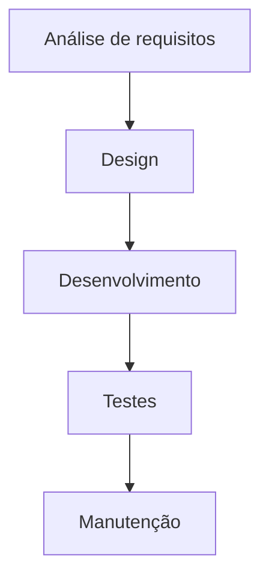

tipo: #curso
link: https://on.fiap.com.br/

Parte de [[FIAP DevOps & Agile Culture]]

## DevOps FIAP 

### Capítulo 2 -  Metodologia e Melhores Práticas de Desenvolvimento de Software

A Tecnologia da Informação, seus *softwares*, serviços e aplicativos desempenham um papel cada vez mais predominante na sociedade atual.

O desenvolvimento de tais softwares, serviços e aplicativos ocorre a partir de [[Metodologias de Desenvolvimento de Software|metodologias de desenvolvimento de software]].

O [[Sistema Toyota de Produção ]]possui grande influência nas metodologias de desenvolvimento de software mais modernas, sobretudo as práticas de [[jidoka]], [[kanban]] e entregas [[JIT]].

### Modelo *Waterfall*

O modelo *Waterfall*, ou de **desenvolvimento em cascata** é uma sequência de etapas seguida em projetos de desenvolvimento de software, conforme ilustrado a seguir:



Apesar de ainda utilizado em muitas empresas, o modelo *Waterfall* apresenta diversos desafios.

```ad-info
title: 4 desafios do modelo *Waterfall*
**Escopo engessado no começo do projeto:** uma mudança de demanda pode tornar o produto *irrelevante* até o final do projeto.

**Desperdício com funcionalidades desnecessárias:** já que tudo é definido no começo, a tendência é pedir o máximo de funcionalidades possível, mesmo sem certeza de sua necessidade. 

**Entregas lentas:** a velocidade de entrega é lenta. A primeira delas só ocorre após um longo período de planejamento, execução e testes de grandes porções da solução. Além disso, não é garantia de que aquela entrega represente valor imediato para o cliente.

**Baixa transparência:**  apenas com processos e documentações extensas não é possível manter o envolvimento de todos. A tendência, então, é que as pessoas não estejam cientes do processo tanto quanto necessário.
```

### Manifesto Ágil

Surgiu no ano 2000, após uma reunião de  líderes da comunidade de XP (*Extreme Programming*) em que discutiram o desenvolvimento com XP e resolveram documentar pontos que consideraram importantes em relação ao desenvolvimento de software.

O **Manifesto Ágil** possui **4 valores**: ^cdbcc4

```ad-info
title:Os 4 valores do Manifesto Ágil
1. **<u>Indivíduos e interações</u>** mais que processos e ferramentas: processos e ferramentas devem cumprir seu papel de forma simples e útil, mas desenvolvimento de software sendo uma atividade humana, os eventuais problemas de comunicação devem ser resolvidos a partir da colaboração entre os membros da equipe.
2. **<u>Software em funcionamento</u>** mais que documentação abrangente: software funcionando é o que o cliente espera, e também um indicador de sucesso do projeto. Já a documentação deve agregar valor e trazer apenas informações úteis.
3. **<u>Colaboração com o Cliente</u>** mais que negociação de contratos: deve-se sempre buscar trabalho em equipe e tomada de decisões em conjunto com o cliente, para alcançar o sucesso no desenvolvimento de software.
4. **<u>Responder a mudanças</u>** mais que seguir um plano: dada a complexidade e a incerteza presentes em um desenvolvimento de software, é necessário aprender constantemente com as mudanças e adaptar o plano sempre que possível.
```

O Manifesto Ágil também é composto de **12 princípios**, a saber: ^5102c3

```ad-info
title:Os 12 princípios do Manifesto Ágil
1. Nossa maior prioridade é satisfazer o cliente através da entrega contínua e adiantada de software com valor agregado.

2. Aceitar mudanças de requisitos, mesmo no fim do desenvolvimento. Processos ágeis se adequam a mudanças, para que o cliente possa tirar vantagens competitivas.

3. Entregar frequentemente software funcionando, de poucas semanas a poucos meses, com preferência à menor escala de tempo.

4. Pessoas de negócio e desenvolvedores devem trabalhar diariamente em conjunto por todo o projeto.

5. Construir projetos em torno de indivíduos motivados, dando a eles o ambiente e o suporte necessário e confiando neles para fazer o trabalho.

6. O método mais eficiente e eficaz de transmitir informações para e entre uma equipe de desenvolvimento é por meio de conversa face a face.

7. Software funcionando é a medida primária de progresso.

8. Os processos ágeis promovem desenvolvimento sustentável. Os patrocinadores, desenvolvedores e usuários devem ser capazes de manter um ritmo constante indefinidamente.

9. Contínua atenção a excelência técnica e bom design aumenta a agilidade.

10. Simplicidade: a arte de maximizar a quantidade de trabalho não realizado é essencial.

11. As melhores arquiteturas, requisitos e designs emergem de times auto-organizáveis.

12. Em intervalos regulares, a equipe reflete sobre como se tornar mais eficaz e então refina e ajusta seu comportamento de acordo.
```

#### Agile Alliance

A *Agile Alliance* é uma organização sem fins lucrativos que busca promover a disseminação de conceitos e a discussão de métodos ágeis, como [[Scrum]], [[Kanban]] e [[XP]], que carregam em suas bases os [[DevOps FIAP - Capítulo 2 -  Metodologia e Melhores Práticas de Desenvolvimento#^cdbcc4|valores]] e [[DevOps FIAP - Capítulo 2 -  Metodologia e Melhores Práticas de Desenvolvimento#^5102c3|princípios]] do desenvolvimento ágil.

### Por que as "metodologias ágeis" são ágeis?

A maioria das pessoas acredita que as metodologias ágeis são chamadas assim porque são rápidas e entregam funcionalidades e soluções o quanto antes.

**Este conceito está errado.**

A agilidade das metodologias ágeis simboliza a capacidade de se adaptar rapidamente a mudanças: as entregas com velocidade vêm como *consequência* da aplicação correta das metodologias.

### *Framework* Scrum

**[[Scrum]]** é um *framework* simples para o gerenciamento de projetos complexos, baseado em papéis, dinâmicas e cerimônias realizadas ao longo de todo o ciclo. Sua aplicação não está restrita a projetos de TI, e a definição é que **a cada intervalo pré-estabelecido de tempo uma funcionalidade do produto que faz parte do todo seja entregue**.

O nome do *framework* foi inspirado por uma jogada do Rúgbi, onde um jogador avança usando seu próprio corpo como escudo para liberar um outro jogador do seu próprio time, que então avança o máximo possível para marcar mais pontos.

```ad-info
title: Analogia
A comparação com a jogada de Rúgbi é para reforçar a necessidade do trabalho em equipe na resolução dos diversos problemas que podem subir.
```
### Pilares do Scrum

O *framework* do [[Scrum]] se baseia em três pilares:

- **Transparência:** todos possuem o conhecimento dos requisitos, dos processos e do andamento do projeto.
- **Inspeção:** reuniões diárias com a equipe ou eventos de revisão garantem a inspeção contínua do que está sendo realizado.
- **Adaptação:** tanto o processo quanto o produto podem sofrer adaptações ao longo do tempo, conforme mudanças ocorrem. Os valores e práticas ágeis, no entanto, devem ser preservados.

### Papéis do Scrum

O *framework* do [[Scrum]] adota três papéis:

#### Product Owner (PO)

```ad-question
title:Quem é o Product Owner (PO)?
É literalmente o **dono do produto**, quem decide que recursos e funcionalidades ele deve ter e em que ordem de prioridade devem ser desenvolvidas e entregues. Ele também comunica uma visão clara do que o Time Scrum está fazendo, sendo elo de ligação entre sua área de negócios e o time de desenvolvedores.
```

Se não se escolhe um bom PO, pode ser que ele se torne apenas um *PO Proxy*, e isso pode impactar um projeto de maneira negativa.

```ad-caution
title:O perigo do **PO Proxy**!
Quando o PO não sabe com detalhes e domínio o produto, recursos e funcionalidades de que precisa, e não possui autonomia para tomar suas decisões, ele vai acabar dependendo de decisões de outras pessoas, virando um *PO Proxy* — não sabendo o que deve ser feito e sempre dependendo de terceiros para ter seu produto.
```

#### Scrum Master (SM)
```ad-question
title:Quem é o Scrum Master (SM)?
É o responsável por auxiliar os integrantes do time de projeto no entendimento e na aplicação da cultura ágil e do *framework* Scrum, atuando como um líder de processo. Ele atua como facilitador, removendo impedimentos, resolvendo conflitos e protegendo os membros do time contra interferências externas ao projeto.
```

No mercado há uma *confusão* muito comum em relação ao papel do **Scrum Master**: a de que ele é um *chefe*, o que não é verdade. Ele é um membro da equipe como todos os outros, e na verdade também precisa tomar cuidado para não deixar de ser um *facilitador* e se tornar um **bloqueador**, ao proteger sua equipe em excesso.

O **Scrum Master** precisa encorajar o desenvolvimento do time, para que cada membro se torne independente.

#### Scrum Team
```ad-question
title:Quem é o Scrum Team?
É um time de desenvolviment, normalmente composto de 4 a 8 pessoas, que possui membros com diferentes funções e habilidades necessárias para o desenvolvimento do projeto de software. É papel do Time Scrum decidir a estratégia para alcançar o objetivo do desenvolvimento e colaborar entre si para que sejam auto-organizados e disciplinados.
```
Se for necessário um time maior para o desenvolvimento de um projeto — por exemplo, 50 pessoas — o ideal não é formar um único time Scrum, e sim diversos times Scrum menores.

### Valores do Scrum

Assim como no [[DevOps FIAP - Capítulo 2 -  Metodologia e Melhores Práticas de Desenvolvimento#Manifesto Ágil|Manifesto Ágil]], o [[Scrum]] também possui valores, que ao todo são cinco:

- **Foco:** todos devem estar concentrados em um mesmo objetivo, realizado em pequenas partes por vez, alinhadas à priorização realizada pelo Product Owner.

- **Coragem:** é necessária para o time de projeto, que deve enfrentar os diversos desafios que surgirão, ao mesmo tempo em que aceita as mudanças, erra, corrige os erros e aprende com o ocorrido.

- **Comprometimento:** cada um dos membros que participa do time de projeto se compromete de uma forma diferente — conforme o [[DevOps FIAP - Capítulo 2 -  Metodologia e Melhores Práticas de Desenvolvimento#Papéis do Scrum|papel]] que desempenha na aplicação do *framework* Scrum.

- **Respeito:** os membros do time de projeto respeitam uns aos outros, incluindo suas diferenças, mas sentem-se encorajados a interagir entre si e respeitar as opiniões de todos. O *Product Owner* respeita as decisões técnicas do *Time Scrum*, enquanto que o *Time Scrum* respeita as decisões de negócio do *Product Owner*.

- **Abertura:** todos do time de projeto estão abertos aos desafios que serão apresentados, a criar visibilidade sobre o que está ocorrendo e também a dialogar, fornecer e receber *feedback*.

